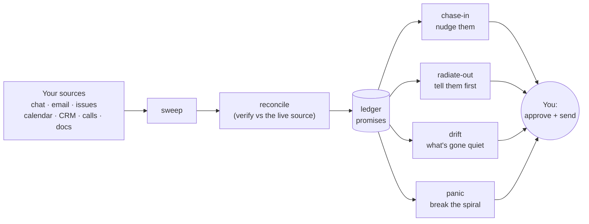

# 🧠 ADHDecoder

**Turn scattered work noise into "here's your one move."**

> Built for ADHD brains: reduce cognitive load, never add to it. It does not
> hoard raw feeds, and it does not invent busywork. It closes the loop.

## What it is

ADHDecoder watches the places people quietly point things at you (chat, email,
issues, calendar, CRM, calls, docs), decodes each new item into a short brief,
and tracks the **promises** flowing in both directions: what others owe *you*
(**chase in**) and what you owe *them* (**radiate out**). Then it surfaces the
one time-sensitive thing you're most at risk of dropping. Every arrow out to you
is a **draft you approve** - nothing auto-sends, auto-posts, or creates a task
on its own.

### What's inside

Each capability is a skill; together they close the follow-up loop:

|    | Skill             | What it does                                              |
| -- | ----------------- | --------------------------------------------------------- |
| 📓 | **ledger**        | the promise store: who owes what, by when, which direction |
| ⏱️ | **set-the-clock** | captures a promise the moment work flows in or out         |
| 📣 | **chase-in**      | surfaces slips as tiered, ready-to-send nudges             |
| 🛰️ | **radiate-out**   | publishes status so people stop chasing *you*              |
| 🌫️ | **drift**         | flags what has quietly gone stale                          |
| 🚨 | **panic**         | mid-spiral, hands you the single next move                 |
| 🧹 | **sweep**         | pulls promises in from your configured sources             |
| 🔎 | **reconcile**     | cross-checks against the live source before acting         |
| 📊 | **board**         | renders your ledger into a multi-tab HTML dashboard        |
| 🧭 | **setup**         | guided, conversational config builder (no hand-editing)    |
| 💬 | **help**          | orientation + the command cheat-sheet                      |
| 🩺 | **doctor**        | read-only health check of your setup                       |

Plus an optional read-only **Obsidian backend** (run it against your existing
Obsidian notes - Markdown + YAML frontmatter - instead of a fresh store; ships in
`adapters/obsidian/`) and a schedulable **daily-run** routine that does one pass
and leaves you a board.

## Install (Claude Code)

1. **Add the marketplace** - from GitHub, `/plugin marketplace add <owner>/adhdecoder`,
   or from a local clone, `/plugin marketplace add /path/to/adhdecoder`.
2. **Install the plugin:** `/plugin install adhdecoder@adhdecoder`.
3. **Reload:** `/reload-plugins`.

No JSON to hand-edit - `setup` builds your config for you (next).

## Quickstart

1. **`help`** - two-line orientation + the command cheat-sheet.
2. **`setup`** - a guided conversation that builds your `config.json` and
   initializes `state.json` (sources, identity, backend, schedule, optional
   context discovery). Ask it "set me up."
3. **"what's slipping"** - your first `chase-in` board.

Not sure your setup is sound? Ask **`doctor`** ("check my setup").

## Configuration reference

`setup` writes these; this is what each field means. Full template:
`config/decoder.config.example.json`.

| Field | Meaning |
| --- | --- |
| `identity.name` / `identity.email` | you |
| `identity.handles.chat` / `.crm` | your user id per source (e.g. Slack member id) |
| `storage.adapter` | `"filesystem"` (the v0.1 adapter) |
| `storage.instancePath` | absolute path to your instance folder (holds `config.json` + `state.json`) - **outside this repo** |
| `storage.knowledgePath` | absolute path to your knowledge vault |
| `storage.overrides.*` | filenames/dirs: `stateFile`, `radarFile`, `archiveFile`, `tasksDir`, `dashboardFile` |
| `ledger.backend` | `"builtin"` (default, writes `state.json`) or a note-backed adapter name |
| `ledger.writeMode` | `"readonly"` (default) or `"readwrite"` (post-cutover only; see below) |
| `ledger.cutover.singleWriterConfirmed` | your explicit confirmation that nothing else writes the note store; required for `readwrite` |
| `watchlist.customers` / `.projects` / `.people` | priority entities that raise stakes |
| `contacts` | per-context channels + people (used by reconcile / sweep) |
| `sources[].type` | `issues` \| `chat` \| `email` \| `calendar` \| `crm` \| `docs` \| `calls` |
| `sources[].enabled` | whether this source is swept |
| `sources[].category` | the `~~category` placeholder (see `CONNECTORS.md`) |
| `sources[].weight` | `high` \| `medium` \| `low` - sweep order/depth + surfacing tiebreak |
| `sources[].cadence` | `every-run` \| `daily` \| `hourly` |
| `sources[].tz` / `.noise` | optional: the source's own timezone; a known bulk-sync noise pattern to ignore |
| `schedule.pivots` | run times, e.g. `["08:30","12:30","16:00"]` |
| `schedule.timezone` | IANA timezone |
| `schedule.boardPath` | where the refreshed board is written each run (unset = chat only) |
| `lastSwept` | managed by the plugin; leave `null` |

## Storage & backends

The plugin talks to storage through an adapter, not a hardcoded location.

- **Filesystem adapter (built now):** for storage that keeps **real files
  physically present** on the machine that runs sweeps (local disk, Obsidian
  Sync, Syncthing, git, or pinned Dropbox/OneDrive). You set `instancePath` and
  `knowledgePath`.
- **Connector adapters (spec'd, not yet shipped):** for cloud-native stores
  that serve placeholders instead of real files, reading/writing via the
  service API. Contract in `reference/connector-adapters.md`.

**Ledger backend** is a separate axis (`ledger.backend`):

- **`builtin`** (default): the promise store is `state.json` - always writable.
- **The Obsidian adapter** (optional): overlay your existing Obsidian notes.
  Set `ledger.backend: "obsidian"` (any value `X` resolves to a `ledger-X`
  skill). **Read-only by default:** ADHDecoder never mutates the notes, and its
  own metadata (snooze, verify results) goes to a `state.json` companion. After
  a deliberate **cutover** (`reference/cutover.md`: retire your old writer,
  confirm single-writer, flip `writeMode: "readwrite"`) it also applies your
  approved actions - mark met, updates, promotions - directly to the notes.
  Ships in `adapters/obsidian/`; see `reference/ledger-backend-interface.md`.
  Long-lived sweep-found promises can be **promoted** into real notes, draft
  first, always with your approval (`reference/promotion.md`).

**Two rules that matter:** 👀 **No hidden files** (everything written is visible,
never dot-prefixed) and ✍️ **Single writer** (run sweeps on one machine at a
time, or synced state can conflict).

## Command cheat-sheet

- "what's slipping" / "who do I chase" → **chase-in**
- "what's drifting / gone quiet" → **drift**
- "panic" / "I'm overwhelmed" → **panic**
- "where do things stand for \<context>" → **radiate-out**
- "show my board" / "refresh the dashboard" → **board**
- "is this still open / reconcile this" → **reconcile**
- "\<someone> owes me \<X> by \<date>" / replying to an ask → **set-the-clock**
- "run a sweep" / "daily run" → **sweep** / **daily-run**
- "help" / "set me up" / "check my setup" → **help** / **setup** / **doctor**

## Scheduling (run it without remembering to)

ADHDecoder can run on a schedule via the `daily-run` routine, which does one
non-interactive pass: sweep the configured sources (ordered by `weight`,
honoring `cadence`, every enabled source at least once a day) → reconcile the
about-to-surface items → update the ledger → refresh a read-only **board file** →
print a one-line recap. It drafts and updates only; it never auto-sends or
auto-posts. Full detail in `reference/scheduling.md`.

The board is a multi-tab HTML **dashboard** (Board / Shipped / Waiting on Others /
Tomorrow's Headlines / History), regenerated from the ledger each run. The repo
ships a data-free template at `assets/dashboard-template.html`; only the rendered
output at your `boardPath` holds your data. Ask **"show my board"** or **"refresh
the dashboard"** any time to re-render it on demand (see `reference/dashboard.md`).

- **Trigger the routine at your `pivots`.** The plugin describes the routine;
  your host scheduler runs it. Add a scheduled task at each time in
  `schedule.pivots` that invokes the `daily-run` skill.
- **"Early and often" (optional).** Add extra light runs (e.g. hourly) that sweep
  only `every-run` / high-`weight` sources, so chat stays fresh.
- **Set `schedule.boardPath`** to a durable file (e.g. in your vault). Each run
  overwrites it with the current board; if unset, a run only prints to chat.

`weight` and `cadence` shape emphasis and frequency, never urgency: ranking is
always **stakes > time > weight**, so a genuine emergency from a low-weight
source still surfaces first.

## Guardrails

The non-negotiables, enforced everywhere:

- **Never auto-send, never auto-post.** Every reply and status is a draft you
  approve.
- **Never auto-create tasks.** Promotion is always deliberate.
- **Never flood.** Dedup hard; overdue items get more prominent, not more numerous.
- **Verified before surfaced.** Nothing is presented as a settled fact or action
  without a fresh reconcile verdict; verified-only goes to any customer-facing
  surface, and no internal links land in customer-facing copy.
- **Flag the sensitive** and the "bigger than it looks."

## Privacy & clean exit

ADHDecoder is split into three buckets so it can follow you anywhere - a new job,
a job hunt, home life:

1. **The plugin (this repo) = the method.** Skills, formats, guardrails. **Zero
   personal or company data.** Portable, versioned, install anywhere. Keep it
   forever.
2. **The instance layer = your config + state.** A `config.json` and `state.json`
   at a path you choose, **outside this repo**. Company-bound and disposable.
3. **The knowledge base = your files.** Radar, tasks, dashboard, as plain
   Markdown/HTML in a folder you point at (e.g. an Obsidian vault).

Your data never lives in the plugin. A `.gitignore` guards against accidentally
committing a `config.json`/`state.json` even if you point `instancePath` into the
repo. **Leaving a context? Drop the instance, keep the method.**

## Under the hood

The durable method lives in `reference/method.md`; onboarding detail in
`reference/onboarding.md`; per-capability specs (sweep, reconciliation,
verification discipline, scheduling, source-links) live alongside them in
`reference/`; optional backend adapters live in `adapters/` (e.g. the Obsidian
adapter in `adapters/obsidian/`). Repo/maintainer orientation is in `CLAUDE.md`.
