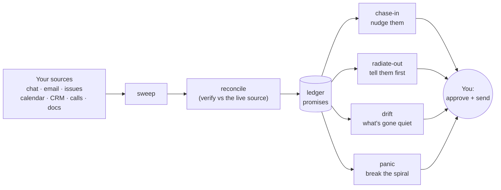

# 🧠 ADHDecoder

**Turn scattered work noise into "here's your one move."**

> Built for ADHD brains: reduce cognitive load, never add to it. It does not
> hoard raw feeds, and it does not invent busywork. It closes the loop.

ADHDecoder watches the places people quietly point things at you (chat, email,
issues, calendar, CRM, calls, docs), decodes each new item into a short brief,
tracks the **promises** flowing in both directions, and surfaces the **one
time-sensitive thing** you are most at risk of dropping.

## 🔁 The loop, in one picture

Every arrow out to you is a **draft you approve**. Nothing auto-sends,
auto-posts, or creates a task on its own.

## ✨ What's inside

Each capability is a skill; together they close the follow-up loop:

|    | Skill             | What it does                                              |
| -- | ----------------- | --------------------------------------------------------- |
| 📓 | **ledger**        | the promise store: who owes what, by when, which direction |
| ⏱️ | **set-the-clock** | captures a promise the moment work flows in or out         |
| 📣 | **chase-in**      | surfaces slips as tiered, ready-to-send nudges             |
| 🛰️ | **radiate-out**   | publishes status so people stop chasing *you*              |
| 🌫️ | **drift**         | flags what has quietly gone stale                          |
| 🚨 | **panic**         | mid-spiral, hands you the single next move                 |
| 🧹 | **sweep**         | pulls promises in from your configured sources             |
| 🔎 | **reconcile**     | cross-checks against the live source before acting         |

Plus an optional read-only **TaskNotes backend** (run it against your existing
Markdown tasks instead of a fresh store) and a schedulable **daily-run** routine
that does one pass and leaves you a board to open.

## 🧩 Portable by design

ADHDecoder is deliberately split into three parts so it can follow you anywhere:
a new job, a job hunt, home life.

1. **The plugin (this repo) = the method.** Skills, formats, guardrails. Zero
   personal or company data. Portable, versioned, install anywhere. This is what
   you keep forever.
2. **The instance layer = your config + state.** A `config.json` and a
   `state.json` at a path you choose (local, or a synced folder). Company-bound
   and disposable. See `config/decoder.config.example.json`.
3. **The knowledge base = your files.** Radar, tasks, dashboard, as plain
   Markdown/HTML in a folder you point at (e.g. an Obsidian vault).

> **Leaving a context?** Drop the instance, keep the method.

## 💾 Storage: bring your own

The plugin talks to storage through an adapter, not a hardcoded location.

- **Filesystem adapter (built now):** for storage that keeps **real files
  physically present** on the machine that runs sweeps (local disk, Obsidian
  Sync, Syncthing, git, or pinned Dropbox/OneDrive). You set two paths:
  `instancePath` and `knowledgePath`.
- **Connector adapters (later):** for cloud-native stores that serve
  placeholders instead of real files (Google Drive especially), reading/writing
  via the service API.

**Two rules that matter:**

- 👀 **No hidden files.** Everything ADHDecoder writes is visible (e.g. a
  `_decoder/` folder holding `config.json` and `state.json`). Never dot-prefixed.
- ✍️ **Single writer.** Run sweeps on one machine at a time, or synced state can
  conflict.

## 🚀 Install (Claude Code)

1. Clone this repo, or add it to a plugin marketplace.
2. Install the plugin into Claude Code.
3. Copy `config/decoder.config.example.json` to your instance folder as
   `config.json` and fill in your paths, identity, watchlist, and sources. For
   each source set `weight` (high|medium|low) and `cadence`
   (every-run|daily|hourly); see Scheduling below.
4. Point `instancePath` at that folder and `knowledgePath` at your vault.

## ⏰ Scheduling (run it without remembering to)

ADHDecoder can run on a schedule via the `daily-run` routine, which does one
non-interactive pass: sweep the configured sources (ordered by `weight`,
honoring `cadence`, every enabled source at least once a day) → reconcile the
about-to-surface items → update the ledger → refresh a read-only **board file** →
print a one-line recap. It drafts and updates only; it never auto-sends or
auto-posts. Full detail in `reference/scheduling.md`.

Wire it up:

- **Trigger the routine at your `pivots`.** The plugin describes the routine;
  your host scheduler runs it. In Cowork, add a scheduled task at each time in
  `schedule.pivots` that invokes the `daily-run` skill.
- **"Early and often" (optional).** Add extra light runs (e.g. hourly) that
  sweep only `every-run` / high-`weight` sources, so chat stays fresh without
  re-hitting everything.
- **Set `schedule.boardPath`** to a durable file (e.g. in your vault). Each run
  overwrites it with the current board (chase-in + drift + handoff follow-ups,
  with source links), the place to look between runs. If unset, a run only
  prints to chat.

`weight` and `cadence` shape emphasis and frequency, but never urgency: ranking
is always **stakes > time > weight**, so a genuine emergency from a low-weight
source still surfaces first.

## 🛡️ Guardrails

The non-negotiables, enforced everywhere:

- **Never auto-send, never auto-post.** Every reply and status is a draft you
  approve.
- **Never auto-create tasks.** Promotion is always deliberate.
- **Never flood.** Dedup hard; overdue items get more prominent, not more
  numerous.
- **Verified-only outward, and no internal links in customer-facing copy.**
- **Flag the sensitive** and the "bigger than it looks."

## 📚 Under the hood

The durable method lives in `reference/method.md`; per-capability specs
(sweep, reconciliation, scheduling, source-links, the TaskNotes adapter, and
more) live alongside it in `reference/`. Repo/maintainer orientation is in
`CLAUDE.md`.
