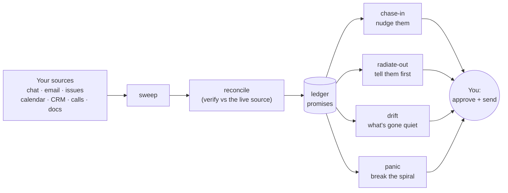

# 🧠 ADHDecoder

**Turn scattered work noise into "here's your one move."**

> Built for ADHD brains: reduce cognitive load, never add to it. It does not
> hoard raw feeds, and it does not invent busywork. It closes the loop.

## What it is

ADHDecoder watches the places people quietly point things at you (chat, email,
issues, calendar, CRM, calls, docs), decodes each new item into a short brief,
and tracks the **promises** flowing in both directions: what others owe *you*
(**chase in**) and what you owe *them* (**radiate out**). Then it surfaces the
one time-sensitive thing you're most at risk of dropping. Every arrow out to you
is a **draft you approve** - nothing auto-sends, auto-posts, or creates a task
on its own.

### What's inside

Each capability is a skill; together they close the follow-up loop:

|    | Skill             | What it does                                              |
| -- | ----------------- | --------------------------------------------------------- |
| 📓 | **ledger**        | the promise store: who owes what, by when, which direction |
| ➕ | **ledger**        | the promise store; also "add a task" -> a real task note    |
| ⏱️ | **set-the-clock** | captures a promise the moment work flows in or out         |
| 📣 | **chase-in**      | surfaces slips as tiered, ready-to-send nudges             |
| 🛰️ | **radiate-out**   | publishes status so people stop chasing *you*              |
| 🌫️ | **drift**         | flags what has quietly gone stale                          |
| 🧭 | **projects**      | declare a multi-week effort; it claims matching work        |
| 🚨 | **panic**         | mid-spiral, hands you the single next move                 |
| 🧹 | **sweep**         | pulls promises in from your configured sources             |
| 🔎 | **reconcile**     | cross-checks against the live source before acting         |
| 📊 | **board**         | renders your ledger into a multi-tab HTML dashboard        |
| 🧭 | **setup**         | guided, conversational config builder (no hand-editing)    |
| 💬 | **help**          | orientation + the command cheat-sheet                      |
| 🩺 | **doctor**        | read-only health check of your setup                       |

Plus an optional read-only **Obsidian backend** (run it against your existing
Obsidian notes - Markdown + YAML frontmatter - instead of a fresh store; ships in
`adapters/obsidian/`) and a schedulable **daily-run** routine that does one pass
and leaves you a board.

## Skills in depth

Each skill below is a paragraph, not the spec - full detail lives in each
`skills/<name>/SKILL.md` and the relevant `reference/*.md`. Promises point one
of two directions, set by set-the-clock: `i-owe-them` (you owe someone) or
`they-owe-me` (someone owes you).

### board

Renders the ledger into the multi-tab HTML dashboard (Board / Shipped /
Waiting on Others / Tomorrow's Headlines / Projects / History). Triggered by
"show my board", "refresh the dashboard", "open the board", "render the
dashboard", or "regenerate my board". It calls `scripts/render-board.py`, a
pure function of config + ledger + clock that never reconciles on its own -
so board checks ledger freshness first (sweeping if `lastSwept` is stale) and
reconciles any card whose `verifyStatus` is null or TTL-stale before handing
off to the renderer. `reference/dashboard.md` explains a non-obvious fix: "done
today" and "ready to close" originally shared one visual style distinguished
only by a group label, and at a glance the board read as more finished than
it actually was - so ready-to-close got its own teal variant, because a
pending confirmation and genuinely finished work are not the same state.

### chase-in

Phase 3: turns slipping promises into tiered, ready-to-send nudges. Triggered
by "who do I need to chase", "what's slipping", "what should I follow up on",
"run my chases", "chase in", "who's overdue and what do I say", "draft a
nudge for \<person>", or "what's falling through the cracks". It reads the
ledger only, recomputing overdue from `expectBy` vs. today, and never sweeps
a source directly - before drafting any nudge it hands the candidate to
`reconcile`, its only source cross-check. Tiering is by stakes (high-stakes
surfaces from due-soon onward; normal-stakes stays quiet until overdue), and
a slipping promise never reappears as a new item - it moves up an escalation
rung (friendly check-in → firmer → loop in a manager), which is the "no
flood" principle made concrete.

### daily-run

The scheduled, non-interactive routine: sweep → reconcile → update the
ledger → refresh the board → one-line recap, in a single pass. Triggered by
"run the decoder", "daily run", "do a scheduled run", "refresh the board", or
when wiring a cron/scheduled task. Because a scheduled run can never prompt
for approval, it never calls `capture` or `promote` - both require
`--confirmed`, an explicit human action - so an unattended pass can enrich
existing promises but never create a note. It also enforces the rule that
every enabled source is swept at least once per calendar day regardless of
`weight` or `cadence`, closing the gap where a quiet low-priority source
could otherwise go unswept indefinitely.

### doctor

A read-only health check, triggered by "check my setup", "adhdecoder
doctor", "is this configured right", "diagnose ADHDecoder", or "why isn't
the decoder working". It reports each check as OK or a gap with a one-line
fix - runtime, config, backend, write mode, record-store integrity, schema,
connector presence, suppressions/sweep results - and never repairs anything
itself. Suppressions are the one place it still does the reading: the board
recap carries a bare count, so `doctor` is where each suppressed ref has to
account for its reason rather than becoming permanent by default. Connector
presence is deliberately reported as `unchecked` rather than a false "OK",
because a subprocess cannot see which MCP connectors the running session has
attached. Schema integrity exists because the schema used
to be prose only: different runs invented different field names for "this
note is malformed," and one of those inventions was write-only - a run
recorded a damaged note and nothing surfaced it for weeks.

### drift

Flags promises that look stalled, observationally rather than accusingly.
Triggered by "what's drifting", "what's stalled", "what have I not
touched", or "check for drift", and internally whenever `panic` runs its
drift check or a sweep does a quiet passive flag. It computes staleness from
ledger dates - days since `lastVerified` for overdue/due-soon-high-stakes
items with a real due date, plus a business-day fallback for open items with
none - then reconciles each surfaced candidate before showing it, the same
bounded-to-candidates discipline as chase-in. The no-due-date fallback
measures staleness from when a human last touched the item
(`derived.lastTouched`), not from `lastVerified` - measuring from
`lastVerified` was tried first and hid real rot, because a sweep refreshes
`lastVerified` on everything it looks at, so the automated pass meant to
catch stalled work was instead certifying it as fresh; on a live ledger,
three untouched items showed "0 days stale" under that scheme.

### help

Orientation for someone who just installed ADHDecoder, triggered by "what
can ADHDecoder do", "get started with ADHDecoder", "how do I use
ADHDecoder", "ADHDecoder help", or "what are the commands". Read-only: a
two-line explanation of the loop-closer model (chase-in + radiate-out,
everything a draft) plus the command cheat-sheet, leading with a pointer to
`setup` if config is missing or thin. It's the entry point that routes
everywhere else - not set up, point to `setup`; set up but something looks
off, point to `doctor`.

### ledger

Phase 1, the promise store itself: add a task, or read/write/query
promises. Triggered by "add a task", "remind me to \<X>", "I need to \<X>",
"put this on my list", "capture this", "add a task to \<X> by \<date>", and
read-side phrases like "what am I waiting on", "who owes me", "mark this
met/done", "what's overdue". "Add a task" is the most common path - it
writes a real note immediately, with no due date and no interrogation -
while a sweep-found "they-owe-me" stall goes through `add`, which does
enforce the full reality gate (named owner + concrete what + `expectBy`).
Every write, on any backend, goes through `scripts/ledger_write.py` and
every read through `scripts/ledger_query.py` - the single implementations
every other skill calls rather than re-deriving overdue/stakes/staleness
itself, because a second derivation of "overdue" is a second answer, and the
two disagree exactly where it hurts: an overridden deadline chased as if it
were hard, or a snoozed item resurfacing.

### panic

The reactive spiral-breaker, triggered by "panic", "SOS", "I'm freaking
out", "I'm spiraling", "what's on fire", "I don't know where to start", or
"I'm overwhelmed". It shows the top 2-3 most time-sensitive items (never the
full board), a drift check, the one item likely being avoided (approximated
as the most time-sensitive i-owe-them item), and one small next move - pure
ephemeral, rendered in chat only, writing no promise data itself. It
reconciles only the handful of items it's about to show, reusing drift's
reconcile results within the same run so nothing is verified twice - the
speed that makes it usable mid-spiral. The design principle stated plainly
in its own description: it regulates, it does not aggregate; dumping the
full ledger is the failure mode this skill exists to prevent.

### projects

Declares and tracks a multi-week effort that then claims matching work as it
arrives. Triggered by "start a new project", "I'd like to track X as a
project", "I've been assigned X", "add this to my \<name> project", "how are
my projects", "check in on \<project>", or "stop tracking \<project>". It
interviews the user one question at a time and always previews what a
project's keyword/source rules would actually claim before writing, because
the words a user says are rarely the words in their ledger: measured against
a real 100+ promise ledger, "tech writing" and "documentation" both matched
zero items, while the real vocabulary in use was "doc," "docs," "Confluence
page," "playbook." A project is declared, never inferred - a customer is
never treated as one - and it only ever writes `state.json`, never a note,
because it's a lens over the ledger, not a second store.

### radiate-out

Phase 4, the mirror of chase-in: composes a per-context "Where things stand"
status draft. Triggered by "give me a status update for \<context>", "where
do things stand with \<context>", "draft an update for \<context>", "what
should I tell \<context>", "post a status to \<channel>", or reactively "any
update on \<thing>". It reads the ledger through the same Query interface as
chase-in/drift/panic, groups by context, and - the hard gate - only includes
a promise in the outward draft once `reconcile` has confirmed it against its
live source; anything unverified moves to a separate internal "confirm
before sending" list instead. This gate replaced a plain freshness check
specifically because freshness alone missed a real mis-attributed item in
production - a promise tagged to the wrong customer read as "fresh" and
would have gone out regardless, which is why verification, not recency, is
the bar.

### reconcile

The cross-cutting verification skill: cross-checks a promise against its
live source before it's chased or published. Triggered explicitly by
"verify this", "double-check X against Jira/Salesforce/Slack", "is this
still open", "reconcile my chases", "confirm before we publish", and
internally by every other skill before it surfaces or acts on an item. It
dispatches by `promise.source.type` to a per-source adapter (issues, crm,
chat, email, calendar, docs, calls) and is read-only against every source
and against read-only backends - only the builtin `state.json` backend gets
verify-metadata writes. Its mis-attribution signal is the clearest example
of design-by-measurement in this repo: it started as a hard verdict
(automatically marking a promise `mis-attributed` whenever its `owner`
wasn't on that context's people roster), but tested against a real
31-promise ledger it fired on 8 of 10 checkable promises and was wrong
nearly every time, because real `owner` values are prose describing a
vendor, a team, or several people at once - not a single roster name. It was
downgraded to an advisory signal that only fires on actual cross-context
evidence, cutting false positives from 8 to 2.

### set-the-clock

Phase 2, captures the promised-by date at the moment work flows in or out.
Two triggers: (1) every decode reply ends with a clock-setting question; (2)
an "outbound watch" fires only on high-stakes threads when the user gives
info out with no return date - "let them know", "I'll send them X", "told
them I'd...", "just replied", "sent the update", "answered \<person>". It
never auto-logs and never auto-sends - it prompts, the user confirms, and
the write is handed to the `ledger` skill's reality gate (named owner +
concrete what + a date, or explicit user confirmation). It gates first on
"is this even a promise": a task the user gives themselves ("add a task",
"remind me to X") has no counterparty and routes straight to `ledger`'s
`capture` instead, because interrogating someone for an owner and deadline
that don't exist is worse than doing nothing - and the outbound-watch
trigger is deliberately scoped to high-stakes threads only so it doesn't
fire on every message that goes out (no flood).

### sweep

The source-facing pass that populates the ledger. Triggered by "run a
sweep", "scan my sources", "what's stalled across my tools", "check for new
stalls", "sweep my chat/email/issues", or "refresh the ledger from my
sources". For each configured source it finds items pointed at the user,
applies the four-part stall signal (user owes the next move, genuinely still
open, gone quiet in business days, someone is waiting), and - the
sweep-to-reconcile relationship at the center of the whole system - runs
every candidate through the same per-source `reconcile` adapters the rest of
ADHDecoder uses before writing anything: sweep finds candidates, reconcile
verifies them, and only a `verified-open` result proceeds to dedup and
write. The three-pass chat adapter (mention search, a self-expanding
known-channel registry, silent-reply thread tracking) exists because of a
specific failure that justified building it: search alone was proven
unreliable against real data when a concise mention search showed two
customers' threads as unanswered when the user had actually already replied
and acted the same day - both false alarms that reading the full thread
would have caught. A sweep is also blocked from re-raising a ref you have
retired: `suppress` records a source ref that must never become a promise
again (with a required reason), and `add` refuses one outright, so the block
is enforced rather than remembered. That gate exists because of its own
specific failure - a ticket where the user was only a watcher was captured,
correctly marked met, and then reopened by a later scheduled sweep, costing
three rounds of attention for work that had already shipped.

## Install (Claude Code)

**Prerequisite: Python 3.8 or newer on your PATH as `python3`. Nothing to
install with it.** A few operations (the ledger read, the board render, the
schema check) are committed scripts rather than prose, so they behave the same
every run. They use only the Python standard library - no `pip install`, no
virtualenv - so macOS (`/usr/bin/python3`) and any mainstream Linux already
satisfy this. On Windows, install Python and make sure `python3` resolves.

1. **Add the marketplace** - from GitHub, `/plugin marketplace add <owner>/adhdecoder`,
   or from a local clone, `/plugin marketplace add /path/to/adhdecoder`.
2. **Install the plugin:** `/plugin install adhdecoder@adhdecoder`.
3. **Reload:** `/reload-plugins`.
4. **Check it:** run `doctor`. Its first check confirms `python3` resolves and the
   scripts run, so a missing runtime is diagnosed up front rather than mid-task.

No JSON to hand-edit - `setup` builds your config for you (next).

## Quickstart

1. **`help`** - two-line orientation + the command cheat-sheet.
2. **`setup`** - a guided conversation that builds your `config.json` and
   initializes `state.json` (sources, identity, backend, schedule, optional
   context discovery). Ask it "set me up."
3. **"what's slipping"** - your first `chase-in` board.

Not sure your setup is sound? Ask **`doctor`** ("check my setup").

## Configuration reference

`setup` writes these; this is what each field means. Full template:
`config/decoder.config.example.json`.

| Field | Meaning |
| --- | --- |
| `identity.name` / `identity.email` | you |
| `identity.handles.chat` / `.crm` | your user id per source (e.g. Slack member id) |
| `storage.adapter` | `"filesystem"` (the v0.1 adapter) |
| `storage.instancePath` | absolute path to your instance folder (holds `config.json` + `state.json`) - **outside this repo** |
| `storage.knowledgePath` | absolute path to your knowledge vault |
| `storage.overrides.*` | filenames/dirs: `stateFile`, `radarFile`, `archiveFile`, `tasksDir`, `dashboardFile` |
| `ledger.backend` | `"builtin"` (default, writes `state.json`) or a note-backed adapter name |
| `ledger.writeMode` | `"readonly"` (default) or `"readwrite"` (post-cutover only; see below) |
| `ledger.cutover.singleWriterConfirmed` | your explicit confirmation that nothing else writes the note store; required for `readwrite` |
| `watchlist.customers` / `.people` | priority entities that raise stakes |
| `projects` (in `state.json`, not config) | declared multi-week efforts; see `reference/projects.md` |
| `contacts` | per-context channels + people (used by reconcile / sweep) |
| `sources[].type` | `issues` \| `chat` \| `email` \| `calendar` \| `crm` \| `docs` \| `calls` |
| `sources[].enabled` | whether this source is swept |
| `sources[].category` | the `~~category` placeholder (see `CONNECTORS.md`) |
| `sources[].weight` | `high` \| `medium` \| `low` - sweep order/depth + surfacing tiebreak |
| `sources[].cadence` | `every-run` \| `daily` \| `hourly` |
| `sources[].tz` / `.noise` | optional: the source's own timezone; a known bulk-sync noise pattern to ignore |
| `schedule.pivots` | run times, e.g. `["08:30","12:30","16:00"]` |
| `schedule.timezone` | IANA timezone |
| `schedule.boardPath` | where the refreshed board is written each run (unset = chat only) |
| `lastSwept` | managed by the plugin; leave `null` |

## Storage & backends

The plugin talks to storage through an adapter, not a hardcoded location.

- **Filesystem adapter (built now):** for storage that keeps **real files
  physically present** on the machine that runs sweeps (local disk, Obsidian
  Sync, Syncthing, git, or pinned Dropbox/OneDrive). You set `instancePath` and
  `knowledgePath`.
- **Connector adapters (spec'd, not yet shipped):** for cloud-native stores
  that serve placeholders instead of real files, reading/writing via the
  service API. Contract in `reference/connector-adapters.md`.

**Ledger backend** is a separate axis (`ledger.backend`):

- **`builtin`** (default): the promise store is `state.json` - always writable.
- **The Obsidian adapter** (optional): overlay your existing Obsidian notes.
  Set `ledger.backend: "obsidian"` (any value `X` resolves to a `ledger-X`
  skill). **Read-only by default:** ADHDecoder never mutates the notes, and its
  own metadata (snooze, verify results) goes to a `state.json` companion. After
  a deliberate **cutover** (`reference/cutover.md`: retire your old writer,
  confirm single-writer, flip `writeMode: "readwrite"`) it also applies your
  approved actions - mark met, updates, promotions - directly to the notes.
  Ships in `adapters/obsidian/`; see `reference/ledger-backend-interface.md`.
  Long-lived sweep-found promises can be **promoted** into real notes, draft
  first, always with your approval (`reference/promotion.md`).

**Two rules that matter:** 👀 **No hidden files** (everything written is visible,
never dot-prefixed) and ✍️ **Single writer** (run sweeps on one machine at a
time, or synced state can conflict).

## Command cheat-sheet

- "what's slipping" / "who do I chase" → **chase-in**
- "what's drifting / gone quiet" → **drift**
- "panic" / "I'm overwhelmed" → **panic**
- "where do things stand for \<context>" → **radiate-out**
- "show my board" / "refresh the dashboard" → **board**
- "is this still open / reconcile this" → **reconcile**
- "add a task" / "remind me to \<X>" → **ledger** (a real task note, no due date needed)
- "\<someone> owes me \<X> by \<date>" / replying to an ask → **set-the-clock**
- "run a sweep" / "daily run" → **sweep** / **daily-run**
- "help" / "set me up" / "check my setup" → **help** / **setup** / **doctor**

## Scheduling (run it without remembering to)

ADHDecoder can run on a schedule via the `daily-run` routine, which does one
non-interactive pass: sweep the configured sources (ordered by `weight`,
honoring `cadence`, every enabled source at least once a day) → reconcile the
about-to-surface items → update the ledger → refresh a read-only **board file** →
print a one-line recap. It drafts and updates only; it never auto-sends or
auto-posts. Full detail in `reference/scheduling.md`.

The board is a multi-tab HTML **dashboard** (Board / Shipped / Waiting on Others /
Tomorrow's Headlines / Projects / History), regenerated from the ledger each run. The repo
ships a data-free template at `assets/dashboard-template.html`; only the rendered
output at your `boardPath` holds your data. Ask **"show my board"** or **"refresh
the dashboard"** any time to re-render it on demand (see `reference/dashboard.md`).

- **Trigger the routine at your `pivots`.** The plugin describes the routine;
  your host scheduler runs it. Add a scheduled task at each time in
  `schedule.pivots` that invokes the `daily-run` skill.
- **"Early and often" (optional).** Add extra light runs (e.g. hourly) that sweep
  only `every-run` / high-`weight` sources, so chat stays fresh.
- **Set `schedule.boardPath`** to a durable file (e.g. in your vault). Each run
  overwrites it with the current board; if unset, a run only prints to chat.

`weight` and `cadence` shape emphasis and frequency, never urgency: ranking is
always **stakes > time > weight**, so a genuine emergency from a low-weight
source still surfaces first.

## Guardrails

The non-negotiables, enforced everywhere:

- **Never auto-send, never auto-post.** Every reply and status is a draft you
  approve.
- **Never auto-create tasks.** Promotion is always deliberate.
- **Never flood.** Dedup hard; overdue items get more prominent, not more numerous.
- **Verified before surfaced.** Nothing is presented as a settled fact or action
  without a fresh reconcile verdict; verified-only goes to any customer-facing
  surface, and no internal links land in customer-facing copy.
- **Flag the sensitive** and the "bigger than it looks."

## Privacy & clean exit

ADHDecoder is split into three buckets so it can follow you anywhere - a new job,
a job hunt, home life:

1. **The plugin (this repo) = the method.** Skills, formats, guardrails. **Zero
   personal or company data.** Portable, versioned, install anywhere. Keep it
   forever.
2. **The instance layer = your config + state.** A `config.json` and `state.json`
   at a path you choose, **outside this repo**. Company-bound and disposable.
3. **The knowledge base = your files.** Radar, tasks, dashboard, as plain
   Markdown/HTML in a folder you point at (e.g. an Obsidian vault).

Your data never lives in the plugin. A `.gitignore` guards against accidentally
committing a `config.json`/`state.json` even if you point `instancePath` into the
repo. **Leaving a context? Drop the instance, keep the method.**

## Under the hood

The durable method lives in `reference/method.md`; onboarding detail in
`reference/onboarding.md`; per-capability specs (sweep, reconciliation,
verification discipline, scheduling, source-links) live alongside them in
`reference/`; optional backend adapters live in `adapters/` (e.g. the Obsidian
adapter in `adapters/obsidian/`). Repo/maintainer orientation is in `CLAUDE.md`.
